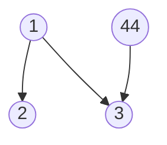

An AVL tree is a self-balancing binary search tree. In an AVL tree, the heights of the two child subtrees of any node differ by at most one; if at any time they differ by more than one, rebalancing is done to restore this property. Figures 1-4 illustrate the rotation rules.



Now given a sequence of insertions, you are supposed to tell the root of the resulting AVL tree.
Input Specification:
Each input file contains one test case. For each case, the first line contains a positive integer N (≤20) which is the total number of keys to be inserted. Then N distinct integer keys are given in the next line. All the numbers in a line are separated by a space.

Output Specification:
For each test case, print the root of the resulting AVL tree in one line.

```c
#include<stdio.h>
#include<stdlib.h>

typedef struct AVLNode *AVLTree;

struct AVLNode{
	int val;
	AVLTree Left;
	AVLTree Right;
	int height;
};
int max(int a,int b)
{
	if(a>b)
		return a;
	else
		return b;
}
int getHeight(AVLTree t)
{
	if(t)
		return max(getHeight(t->Left),getHeight(t->Right))+1;
	else
		return 0;
		
}
AVLTree SingleLeftRotation(AVLTree t)
{
	AVLTree a=t->Left;
	t->Left=a->Right;//断连 
	a->Right=t;
	t->height=max(getHeight(t->Left),getHeight(t->Right))+1;
	a->height=max(getHeight(a->Left),t->height)+1;
	return a;
}	
AVLTree SingleRightRotation(AVLTree t)
{
	AVLTree b=t->Right;
	t->Right=b->Left;
	b->Left=t;
	t->height=max(getHeight(t->Right),getHeight(t->Left))+1;
	b->height=max(getHeight(b->Right),t->height)+1;
	return b;
}	
AVLTree DoubleLeftRightRotation(AVLTree t)
{
	t->Left=SingleRightRotation(t->Left);
	return SingleLeftRotation(t);
}
AVLTree DoubleRightLeftRotation(AVLTree t)
{
	t->Right=SingleLeftRotation(t->Right);
	return SingleRightRotation(t);
}
AVLTree AVL_Insertion(int x,AVLTree t)
{
	if(!t){
		t=(AVLTree)malloc(sizeof(struct AVLNode));
		t->val=x;
		t->height=0;
		t->Left=t->Right=NULL;
	}
	else if(x<t->val){
		t->Left=AVL_Insertion(x,t->Left);
		if(getHeight(t->Left)-getHeight(t->Right)==2){
			if(x<t->Left->val){
				t=SingleLeftRotation(t);//左单旋 
			}
			else{
				t=DoubleLeftRightRotation(t);//左右 
			}
		}
	}
	else if(x>t->val){
		t->Right=AVL_Insertion(x,t->Right);
		if(getHeight(t->Right)-getHeight(t->Left)==2){
			if(x>t->Right->val){
				t=SingleRightRotation(t);//右右 
			}
			else{
				t=DoubleRightLeftRotation(t);//右左
				 
			}
		}
	}
	t->height=max(getHeight(t->Left),getHeight(t->Right))+1;
	return t;
}
void preOrder(AVLTree avl)
{
	if(avl){
		printf("%d ",avl->val);
		preOrder(avl->Left);
		preOrder(avl->Right);
		
	}
}
int main()
{
	int N,i;
	scanf("%d",&N);
	AVLTree avl=NULL;
	for(i=0;i<N;i++){
		int t;
		scanf("%d",&t);
		avl=AVL_Insertion(t,avl);
	}
	printf("%d",avl->val);
//	preOrder(avl);
	return 0;
}
```
